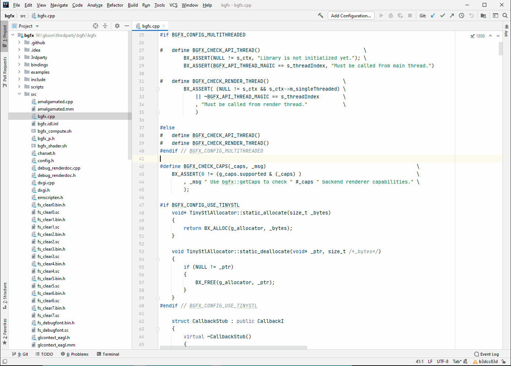

# ij-block-jumper

<!-- Plugin description -->
This plugin helps navigating by jumping across whitespace delimited blocks.

Jump across paragraphs (whitespace delimited blocks). More or less equivalent to 'C-]' in vim.
There is no key binding by default, search for BlockJumper in the actions to set them. There are four actions:
 - `ij-block-jumper.Forward`: Move one paragraph _down_
 - `ij-block-jumper.Backward`: Move one paragraph _up_
 - `ij-block-jumper.SelectForward`: Select one paragraph _down_
 - `ij-block-jumper.SelectBackward`: Select one paragraph _up_
<!-- Plugin description end -->

